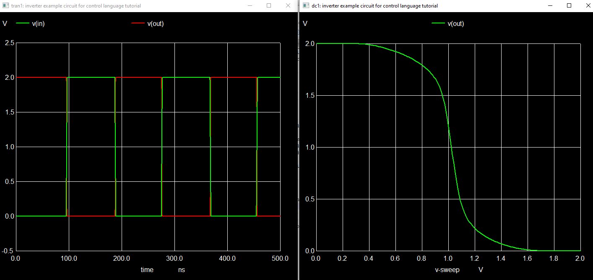
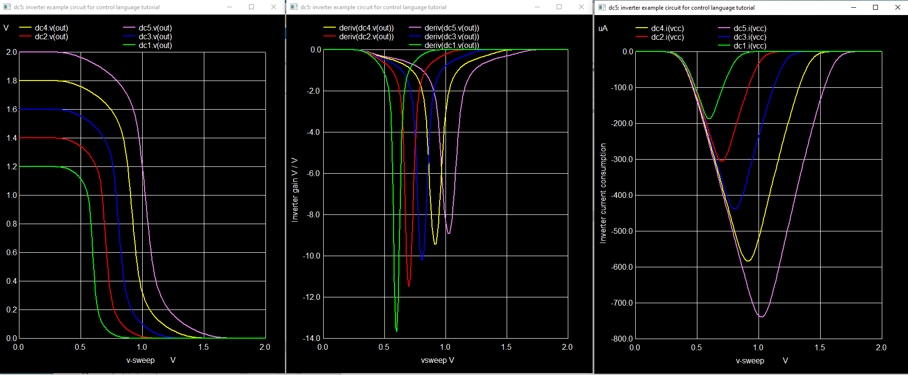

# NGSpice控制语言

## 0.介绍

ngspice电路模拟器提供了一种内置的控制语言（以前称为nutmeg语言）。它允许创建脚本来自动化模拟流程并提供对模拟数据分析的支持。

有三种基本方法可以使用ngspice启动模拟。传统方法是批处理模式。给定输入网络列表（参见下文），命令ngspice -b -r inv-example.raw inv-example.cir将启动模拟，执行网络列表中的dot命令，并将模拟数据保存在“raw”文件中，而无需任何进一步的用户交互。另一方面，我们有交互模式。您可以通过ngspice inv-example.cir启动ngspice。ngspice会源代码网络列表，然后等待用户输入。您可以输入ngspice手册第17.5章中找到的任何命令或ngspice xhtml手册以启动某些操作（例如运行模拟，绘制或保存数据等）。然而，使用这些命令的真正强大之处在于运行ngspice的第三种模式，即控制模式。您可以将一系列命令组装成脚本，将此脚本添加到网络列表中，然后像往常一样通过ngspice inv-example.cir启动ngspice。ngspice将执行来自脚本的命令，启用多个模拟，循环，数据处理，绘图和保存数据。约有100个命令可用，脚本可以从几行简单的脚本到具有几百个命令的复杂脚本不等。

而本教程就是要讲解如何使用控制语言来实现ngspice的高效模拟。

本教程将提供几个示例，从运行模拟和绘制结果的简单支持脚本开始，到一些更高级的技术。您可以将这些示例（网络列表和控制部分）复制并粘贴到您的输入文件中以运行模拟“实验”。

本教程还未完成，是正在进行的工作，欢迎用户提供反馈和问题。请使用讨论论坛进行反馈和问题。

有关启动ngspice的更多信息，请参见ngspice手册第16.4章。ngspice下载和安装在ngspice教程中进行了描述。下面脚本中使用的命令并非全部详细说明，请将ngspice手册第17.5章作为参考。

## 1.以反相器为例电路

在整个教程中，我们将使用一个非常简单的电路，一个带有2个晶体管（NMOS和PMOS）的CMOS反相器。该电路的净表如下（以*开头的行为注释行，以;结尾的行为行末注释）：

```ngspice
inverter example circuit for control language tutorial
* file inv-example.cir

* the power supply 2.0 V
Vcc cc 0 2

* the input signal for dc and tran simulation
Vin in 0 dc 0 pulse (0 2 95n 2n 2n 90n 180n)

* the circuit
Mn1 out in 0 0 nm W=2u L=0.18u
Mp1 out in cc cc pm W=4u L=0.18u

* model and model parameters (we use the built-in default parameters for BSIM4)
.model nm nmos level=14 version=4.8.1
.model pm pmos level=14 version=4.8.1

* simulation commands
.tran 100p 500n

* control language script
.control                                    ; begin of control section
run                                         ; run the .tran command
set xbrushwidth=2                           ; set linewidth of graph
plot v(in) v(out)                           ; plot the simulation results
write $inputdir/simout.out v(in) v(out)     ; write the results to a file
.endc                                       ; end of control section

.end
```

从**plot**命令中的得到的两个**图形**是图1。



图1 逆变器输入/输出与时间以及逆变器输出与输入电压之间的关系

命令**reset**是在瞬态仿真后设置内部数据的重置。如果您不想要图形输出，而只是想要将输出写入文件，可以通过添加**quit**命令来修改脚本：

```ngspice
* control language script
.control
tran 100p 500n               ; simulation command 1
write $inputdir/outtran.out v(in) v(out)
reset
dc vin 0 2 0.01              ; simulation command 2
write $inputdir/outdc.out v(out)
quit
.endc
.end
```

现在完成控制脚本后，ngspice会立即退出。因此绘图没有意义（除非安装了**gnuplot**，可以使用gnuplot命令）。

## 3.循环模拟，改变供电电压

下一个脚本执行一个重复循环。重复五次，改变反相器的电源电压，每次运行一个新的直流仿真。最后，所有的直流仿真结果都在一个图中绘制出来。此外，我们还会绘制反相器的增益和在直流扫描期间的电流消耗。

```ngspice
* control language script
.control
let vccc = 1.2            ; create a vector vccc and assign value 1.2
repeat 5                  ; loop start
  alter Vcc $&vccc        ; alter the voltage Vcc using vector vccc
  dc vin 0 2 0.01         ; run the dc simulation
  let vccc = vccc + 0.2   ; calculate new voltage value for Vcc by updating vector vccc
end                       ; loop end, jump back to loop start
set xbrushwidth=2         ; assign value 2 to the predefined variable
plot dc1.v(out) dc2.v(out) dc3.v(out) dc4.v(out) dc5.v(out)
set nounits               ; do not plot units on the x and y axes.
plot deriv(dc1.v(out)) deriv(dc2.v(out)) deriv(dc3.v(out)) deriv(dc4.v(out)) deriv(dc5.v(out)) ylabel 'Inverter gain V / V' xlabel 'vsweep V'
unset nounits             ; undo the previous set command
plot dc1.I(vcc) dc2.I(vcc) dc3.I(vcc) dc4.I(vcc) dc5.I(vcc) ylabel 'Inverter current consumption'
```

图2是三个**plot**命令得到的结果。



图2 反相器输出、增益和电流消耗与输入电压的关系

在这个脚本中引入了几个新概念。请参考手册的第17.5章了解命令的详细信息。repeat 5 ... end将包含的命令循环执行五次。let vccc = 1.2创建一个向量（长度为1）并将值1.2赋给它。let vccc = vccc + 0.2将0.2加到当前向量值上。alter Vcc $&vccc根据向量vccc的值改变电压Vcc。$&vccc返回向量vccc的值。nounits和xbrushwidth是预定义变量（见手册第17.7章）。命令plot通过将一个或多个向量与一个比例向量（在瞬态情况下预定义为时间，而在直流情况下预定义为电压扫描）进行绘制，生成图形输出。最后和所有先前的直流模拟的结果可以通过dc1.v(out)、dc2.v(out)等进行访问。这将在下一段中解释。plot deriv(dc1.v(out))使用函数deriv，返回v(out)相对于电压扫描的导数（见手册，第17.2章），因此绘制了反相器的电压增益。直流扫描期间的供电电流被测量为电压源Vcc的电流输出，因此呈现为负数。

## 4.关于绘图、变量和向量

任何仿真的输出数据都可以作为向量进行访问。工作点仿真将创建长度为1的向量，DC仿真将创建长度由扫描点数确定的向量。这些向量存储在“plots”中，这是传统SPICE概念（也请参阅手册第17.3章）。这里的“plot”不应与绘制数据得到的图形相混淆。因此，一个“plot”是一组向量。在我们的示例中，第一个DC命令将在plot“dc1”中生成多个向量。随后的DC命令将在plot“dc2”中存储它们的向量，依此类推。瞬态仿真向量将存储在plots“tran1”、“tran2”等中。因此，每个仿真命令（dc、op、tran、sp等）都会创建一个新的plot。最后创建的plot将保持活动状态，直到创建或选择另一个plot。还有一些函数会创建它们自己的plots，例如fft或linearize。命令setplot将显示所有plots并标记活动plot。对于我们的示例，我们有以下plots:

(WIP)
