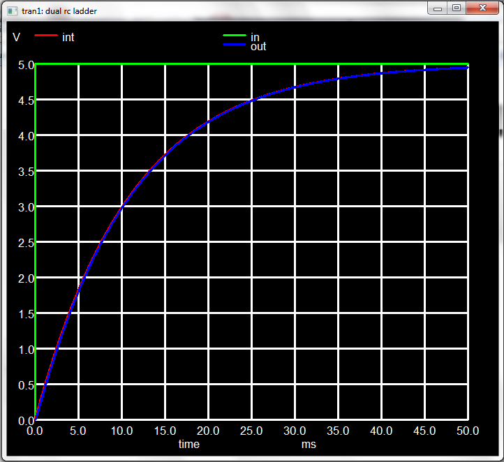

# 初学者的NGSpice

## 介绍

ngspice是一个电路模拟器，用数值方法求解描述(电子)电路的方程：这些方程由无源和有源元件组成。模拟时变电流和电压以及噪声和小信号的特性。ngspice是加州大学伯克利分校久负盛名的 spice3f5的开源继承者。


图一

就像图一展示的一样，你从一个电路（这里是逆变器）开始。你必须创建一个描述这个电路的网表（netlist）。网表是ngspice的输入，告诉它要模拟的电路。与一些模拟命令一起，这个输入负责读取和解析网络列表，启动模拟并绘制输出。输出电压(用红色表示)与输入(绿色表示)相反。两个电压都随时间变化。

ngspice 的输入是从文件中读取的，并且可以通过命令行中给出的命令对其进行增强。模拟输出可以写入文件，也可以绘制成y-x图或 Smith图。虽然没有电路图示意图捕捉和自动生成网表的图形用户界面，但是有[第三方工具](https://ngspice.sourceforge.io/resources.html)可以绘制电路并生成ngspice网表。

这里是一份可用的ngspice的详细的[参考手册](https://sourceforge.net/projects/ngspice/files/ng-spice-rework/37/ngspice-37-manual.pdf/download)。
本手册描述了 ngspice 中可用的所有命令和过程，并列出了许多示例。但是，它不是一个 如何使用ngspice或者介绍性的文章。
如果您有兴趣获得更深入的信息，您可以参考我们的[书籍页面](https://ngspice.sourceforge.io/books.html)或[第三方教程列表](README.md)。

## (1) 下载和安装ngspice（MS WIndows, 64位）

下载这个[ngspice-37](https://sourceforge.net/projects/ngspice/files/ng-spice-rework/37/ngspice-37_64.zip)的zip文件。展开压缩包到C:\下。在MS Windows 10你可能呢个需要管理员权限才能这么做。这样你就会得到C:\Spice64和几个子文件夹。主程序ngspice.exe就在C:\Spice64\bin中。

如果你想要使用PSPICE元件模型（通常由半导体公司提供），在你的用户目录（C:\users\‘你的名字’，也可以在环境变量USERPROFILE中找到）放置一个纯文本文件命名为“.spiceinit”。增加如下两行：

```plaintext
    *user provided init file
    set ngbehavior=ps
```

到“.spiceinit”中。如果文件名“.spiceinit”对你不奏效，使用另一个文件名“spice.rc”。就那样！

在双击“C:\Spice64\bin\ngspice.exe”之后，nspice主窗口就会弹出。


图二

## （2）下载和安装ngspice（Linux）

如果你正在使用Linux，请检查你的发行版提供了一个[ngspice软件包](https://ngspice.sourceforge.io/packages.html)用于安装。你可能使用发行版的包管理工具（apt,Yast等等）安装。

如果不是，你需要下载[ngspice-37.tar.gz](https://sourceforge.net/projects/ngspice/files/ng-spice-rework/37/ngspice-37.tar.gz/download)并用以下命令编译ngspice：

```shell
./configure --with-x --enable-xspice --enable-cider --with-readline=yes --enable-openmp --disable-debug CFLAGS="-m64 -O2" LDFLAGS="-m64 -s"
make -j8
sudo make install
```

或者是运行文件夹下的compile_linux.sh脚本：

```shell
./compile_linux.sh 64
```

请检查[NGSpice手册](https://sourceforge.net/projects/ngspice/files/ng-spice-rework/37/ngspice-37-manual.pdf/download)的32.1章节，了解编译 ngspice-37的先决条件和步骤。编译后把一个命名为.spiceinit的文本文件放在你的/home/username文件夹中，它也可能是root文件夹。添加之前提到的两行到文件顶部。

MacOS用户可能呢个会检查在Homebrew可用的包并安装[适用于macOS的ngspice](https://formulae.brew.sh/formula/ngspice)。[MacPorts](https://ports.macports.org/port/ngspice/)也能提供一个ngspice软件包。

输入和输出现在通过控制台。下面是电路瞬态模拟后的一个典型视图。

```ngspice
******
** ngspice-35 : Circuit level simulation program
** The U. C. Berkeley CAD Group
** Copyright 1985-1994, Regents of the University of California.
** Copyright 2001-2020, The ngspice team.
** Please get your ngspice manual from https://ngspice.sourceforge.io/docs.html
** Please file your bug-reports at https://ngspice.sourceforge.io/bugrep.html
** Creation Date: Aug  8 2021   22:01:36
******
ngspice 6 -> source /home/holger/software/ngspice/examples/soi/inv_tr.sp

Circuit: soi inverter

Doing analysis at TEMP = 27.000000 and TNOM = 27.000000


Initial Transient Solution
--------------------------

Node                                   Voltage
----                                   -------
vd                                         1.5
vs                                           0
gate                                         0
out                                    1.49993
vgate#branch                       1.63484e-06
vgnd#branch                        1.64402e-06
vpower#branch                     -1.64402e-06

No. of Data Rows : 222
ngspice 7 -> 
```

## (3) 无源元件电路，工作点

现在让我们绘制第一个电路图。我们需要一个直流电压源和两个电阻器来构建一个简单的电阻分压器。


图三

这个电路的网表是什么？这个电压源连接在0（接地）和节点“in”之间，值为1；R1接在“in”和“out”之间，值为1k；R2接在“out”和接地之间，值为2k。

```netlist
voltage divider netlist
V1 in 0 1
R1 in out 1k
R2 out 0 2k
.end
```

第1行是一个标题行。第5行中的.end标记了整个网表的结束。将这些文本行输入到一个命名为vdiv.cir的文本文件并保存到C:\Spice64\bin（如果你使用MS Windows）。现在在C:\Spice64\bin双击ngspice.exe打开ngspice。通过输入命令`source vdiv.cir`加载网表。ngspice现在准备好模拟了，网表也加载好了。我们想进行什么类型的模拟呢？我们感兴趣的是节点“out”处的直流电压。这是电路的工作点。我们会通过键入命令`op`获取这个信息。接着我们想要获取节点“out”处的电压。让我们键入`print out`命令。下面是 ngspice 完整的输出序列，可以看到节点“out”处的电压:

```ngspice
******
** ngspice-31 : Circuit level simulation program
** The U. C. Berkeley CAD Group
** Copyright 1985-1994, Regents of the University of California.
** Please get your ngspice manual from https://ngspice.sourceforge.io/docs.html
** Please file your bug-reports at https://ngspice.sourceforge.io/bugrep.html
** Creation Date: Mar 30 2019   09:37:02
******
ngspice 1 -> source vdiv.cir

Circuit: voltage divider netlist

ngspice 2 -> op
Doing analysis at TEMP = 27.000000 and TNOM = 27.000000

No. of Data Rows : 1
ngspice 3 -> print out
out = 6.666667e-01
ngspice 4 ->
```

如果你正在使用Linux，你看恩呢个会将vdiv.cir放到你选择的文件夹里。接着`cd`到这个文件夹并通过命令行窗口调用ngspice。当你直接调用如下命令时，不需要输入`source`命令：

```shell
ngspice vdiv.cir
```

这样这个电路就会被立即加载，然后你输入的下一个命令就是`op`（参考上方）。

## （3） 无源元件电路，瞬态模拟

接下来的示例是一个双重RC振荡器，而且我们希望做一个瞬态模拟。输入是电压波形(脉冲)随时间的变化，输出也是波形，就像你在示波器上看到的，这是我们的电路:


图4

网表是

```ngspice
.title dual rc ladder
R1 int in 10k
V1 in 0 dc 0 PULSE (0 5 1u 1u 1u 1 1)
R2 out int 1k
C1 int 0 1u
C2 out 0 100n
.end
```

我得先讨论下电压源V1。在先前的例子中，它只有一个常数1。现在它更复杂了。手册在章节4.1.1说到：对于一个脉冲我们需要添加PULSE(VL VH TD TR TF PW PER PHASE)到我们电压源的直流电压后面，VL是起始电压，VH是终止电压，TD是延迟，TR和TF分别是上升和下降时间，PW是脉冲宽度，PER是重复的周期，PHASE是相位。我们有一个脉冲从0V到5V，脉冲开始前的延迟，它的上升和下降时间都是1微秒。脉冲宽度和脉冲周期都是1秒，所以这里我们只应用脉冲的上升沿。

现在我们需要的模拟时间是多少？我们的低通滤波器的时间常数主要由R1C1控制，约为1uF*10kOhm = 10ms。因此，我们可以从0开始模拟，一直模拟到50毫秒。我们应该使用1000个数据点，因此步长为50微秒。因此，当你加载电路后，现在的模拟命令是：

```ngspice
tran 50u 50m
```

使用命令plot in out在图5中显示了结果。节点'int'和'out'处的电压几乎没有差别。这是因为第一个R1C1主导了电路。第二个R2C2的时间常数比第一个小100倍，因此相对于充电C1，充电C2变得快速且容易。输入节点'in'的电压上升得如此之快，以至于你看不到它的斜率。



图5

## （5）带有被动元件的电路，小信号交流仿真

现在，我们想看看这个rc阶梯网络的小信号行为可能是什么样的。小信号意味着我们将一个直流工作点设置到电路中。然后我们在输入上添加一个小的交流信号，并模拟输出交流电压随频率的变化。因此，我们必须改变这个小输入信号的频率。我们不关心输出电压的绝对值，而是它与输入的关系（增益）以及它与输入的相位差（相位）。幸运的是，ngspice有一个“ac”命令，使得操作变得容易。首先，我们必须告诉ngspice在哪里输入它们的小信号交流电压。我们选择节点“in”，也就是我们的电压源V1。现在V1变成了：

```ngspice
V1 in 0 dc 0 ac 1 PULSE (0 5 1u 1u 1u 1 1)
```

我们只是添加了“ac 1”。“dc 0”设置工作点（由于我们的简单电路，这并不重要），“PULSE”只在瞬态仿真期间有作用，因此为简单起见，我们保留它。'ac 1'中的1只是为了方便我们得到输出和输入之间的比率，通过将输出除以1或直接使用。仿真命令为：

```ngspice
ac dec 10 1 100k
```

我们想要进行一次“ac”仿真。我们按对数方式变化频率，每个数量级有10个点。起始频率为1 Hz，停止频率为100 kHz。因此，我们将获得51个数据点。如果现在使用命令plot out绘图，图形看起来很丑（输出低于0？）。好吧，我们正在处理交流信号。这些是复数，由实部和虚部组成（或等效地由幅度和相位组成）。传统上，plot out只提供信号的实部。但我们想要看到幅度（或增益）和相位，就像在波德图中一样。因此，应使用plot vdb（out）表示增益（以dB为单位），使用plot ph（out）表示相位。现在图形是可以的，但是标题和标签还不令人满意。这里需要一些手动调整ngspice绘图程序。

但是，在我们继续之前，我们必须简化我们的方法。在控制台中键入所有内容似乎很烦人。ngspice有一种机制，可以将所有交互式命令（我们已输入的命令）汇编到一个.control ... .endc部分中。这个.control部分可以添加到电路网表中，现在看起来像这样：

```ngspice
.title dual rc ladder
* file name rcrcac.cir
R1 int in 10k
V1 in 0 dc 0 ac 1 PULSE (0 5 1u 1u 1u 1 1)
R2 out int 1k
C1 int 0 1u
C2 out 0 100n

.control
ac dec 10 1 100k
plot vdb(out)
plot ph(out)
.endc

.**end**
```

现在我们可以通过命令“ngspice rcrcac.cir”启动ngspice。该电路图被读取，并自动执行.control部分中的命令（ac仿真和绘图）。但我们仍希望改进图形绘制。我们通过使用多个额外命令来实现这一点，这些命令被添加到.control部分。所有这些命令都在[ngspice手册](https://sourceforge.net/projects/ngspice/files/ng-spice-rework/35/ngspice-35-manual.pdf/download)的第17.5章中有描述。完整的输入文件现在如下所示：

```ngspice
.title dual rc ladder
* file name rcrcac.cir
R1 int in 10k
V1 in 0 dc 0 ac 1 PULSE (0 5 1u 1u 1u 1 1)
R2 out int 1k
C1 int 0 1u
C2 out 0 100n

.control
ac dec 10 1 100k
settype decibel out
plot vdb(out) xlimit 1 100k ylabel 'small signal gain'
settype phase out
plot cph(out) xlimit 1 100k ylabel 'phase (in rad)'
let outd = 180/PI*cph(out)
settype phase outd
plot outd xlimit 1 100k ylabel 'phase'
.endc

.end
```

这是我们在仿真和绘图后看到的结果：


图6 双RC阶梯电路的小信号增益和相位差

## （6）下载和安装一个简单的GUI（MS Windows）

我习惯使用MS Windows，所以我不想一直敲命令，而是想用鼠标选择文件、启动仿真并绘制结果。因此，我使用（并提供下载）一个小型GUI，如图7所示。安装方法很简单，只需将这四个文件解压到您选择的文件夹中即可。DuSpiceStart.exe是主要的可执行文件。DuSpicePlot.exe读取原始文件并准备绘图。DuSpiceStart.ini包含设置数据。plot_spex3.xlsm包含一些VB宏，允许使用EXCEL绘图。

(WIP)
